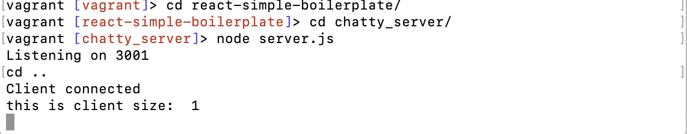
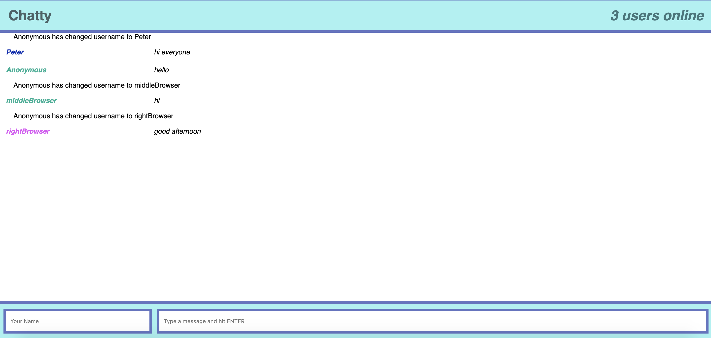

# Chatty App
> Chatty App is a react web application built with React and Websokets

## Test Cases

Multiple users can connect on the same url and have live chat sessions with each other.
Each user has a specific color assigned to them

## About

This App was a good introductory project to learn about the core principles of React and Websockets. After completing this assignment I have a much better understanding of props,states and React's lifecycle components. Also how to use websockets on the client and server side transmitting data.

## Dependanices

    "babel-core": "6.23.1",
    "babel-loader": "6.3.1",
    "babel-preset-es2015": "6.22.0",
    "babel-preset-react": "6.23.0",
    "babel-preset-stage-0": "6.22.0",
    "css-loader": "0.26.1",
    "eslint": "3.15.0",
    "eslint-plugin-react": "6.9.0",
    "node-sass": "4.5.0",
    "sass-loader": "6.0.0",
    "sockjs-client": "^1.1.2",
    "style-loader": "0.13.1",
    "webpack": "2.2.1",
    "webpack-dev-server": "2.3.0"

## How to Run

    install the dependancies above
    open up two terminals
    cd into chatty_server folder that is located in the react-simple-boilerplate and start the websocket on port 3001 with node server.js

 
 
    in your second terminal cd into react-simple-boilerplate and npm start this one is hosted on http://0.0.0.0:3000/

    

## Final Product

